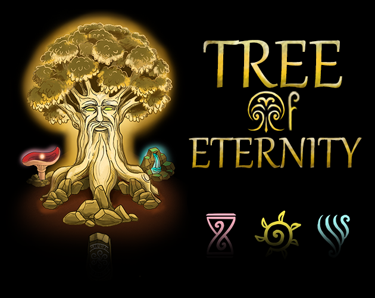

# [Tree of eternity](https://teamon.itch.io/tree-of-eternity)  
Mobile RTS-idler.Protect your tree from waves of enemies  

Made for [Genesis Game Jam](https://genesisgamedevweek.com/jam) in 48 hours. Theme: THEME  

  

# How to play
 * WASD or drag - camera move
 * Drag units to move
 * Click on tree to collect resources

# Downloads and Links
Available in [Windows, OSX, Linux and Android](https://teamon.itch.io/tree-of-eternity). If you encounter any problem, please leave a issue! 
 
# How to open project:
 * Download _Unity 2020.1.15_
 * Download this project via git client. We use LFS, so download as archive would miss some files.
 * Open project as always
 
# Team 
 * Team-on [itch](https://teamon.itch.io/) [github](https://github.com/Team-on) - Unity developer
 * webandrover [itch](https://webandrover.itch.io/) - game designer
 * ainarts [itch](https://itch.io/profile/dimmetrion) [artstation](https://www.artstation.com/ainarts) - 2d/UI artist
 * Oleg Kabanov - analytics
 
# Used assets:
 * [Radial Menu Framework](https://assetstore.unity.com/packages/tools/gui/radial-menu-framework-50601) - radial menus

# Screenshots
  
  
  
